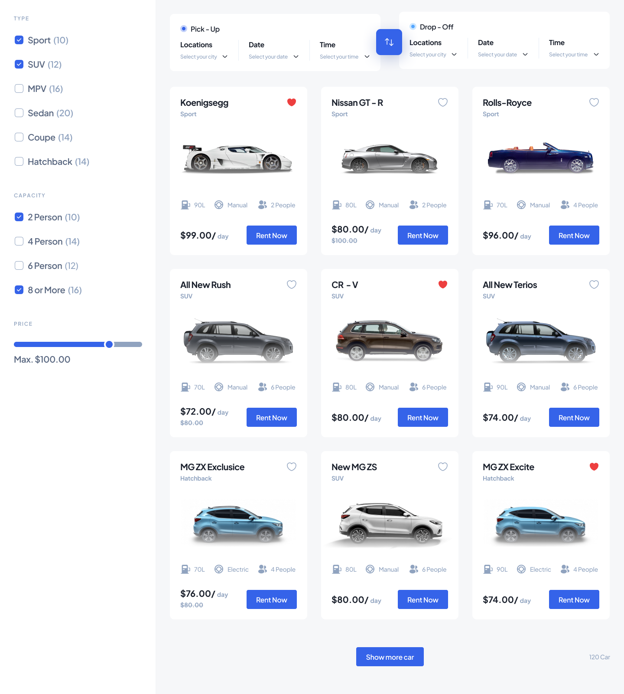
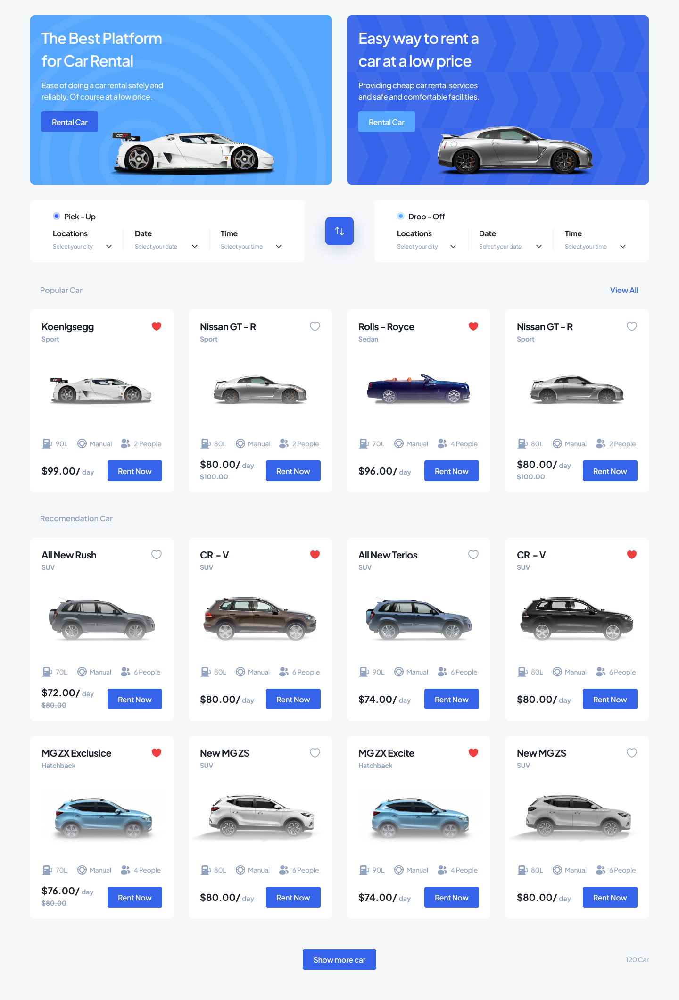
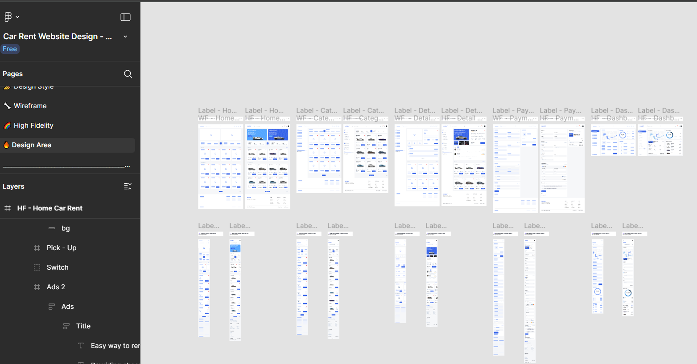

📁 Papka tuzilmasi:
📁 assets/
images/ – sayt uchun barcha rasm fayllar (logo, mashinalar, fonlar).
icons/ – SVG yoki boshqa ikon fayllar.
styles/index.css – Tailwind CSS importlari va umumiy global stillar.

📁 components/
booking/
booking-form/ – mashina ijarasi uchun forma komponenti.

cars/
car-card/ – bitta mashina haqida karta komponenti.
car-list/ – mashinalar ro‘yxatini ko‘rsatadigan komponent.

common/
button/ – butun sayt bo‘ylab ishlatiladigan tugma komponenti.
input/ – input field komponenti.
footer/ - footer komponenti.
navbar/ – saytning navigatsiya menyusi.

📁 contexts/
auth-context.tsx – foydalanuvchini kontekst orqali boshqarish (login/logout).

📁 hooks/
use-car-data.ts – mashinalarni API orqali olish uchun custom hook.

📁 layouts/
main-layout.tsx – saytning umumiy struktura komponenti (Navbar, Footer, <Outlet />).

📁 pages/
auth-page/ - Register va Login sahifasi.
   login.tsx/ - Login sahifasi
   Register.tsx/ - Register sahifasi
booking-page/ – mashina ijarasi (<Payment car rent>) sahifasi.
   /book-load.tsx - loading sahifasi
detail-page/ – mashina sharhi, izohlar (<Detail car rent>) sahifasi.
   /carList-load.tsx - loading sahifasi
car-list-page/ – barcha mashinalar ro‘yxati (<Category car rent>) sahifasi.
   /detailCar-load.tsx - loading sahifasi
home-page/ – (<Home car rent>) asosiy sahifa .
   /home-load.tsx - loading sahifasi

notFound-page/ – 404 sahifasi.
Har biri ichida .tsx va index.ts mavjud.

📁 routes/
index.ts – barcha route’lar eksporti.
protected.ts – Protected komponent: ruxsat asosida sahifaga kirish.
routes.tsx – <Route>lar bu yerda aniqlanadi.

📁 services/
api.ts – axios/fetch asosiy konfiguratsiyasi.
booking-service.ts – ijaraga olish (booking) API funksiyalari.
car-service.ts – mashinalar bilan bog‘liq API funksiyalari.

📁 types/
car.d.ts – mashina modelining tip/interfeysi.
user.d.ts – foydalanuvchi tip/interfeysi.

📁 utils/
constants.ts – doimiy qiymatlar (API URL, role, payment usullari va h.k.).
helpers.ts – yordamchi funksiyalar (sana formatlash, narx formatlash va h.k.).

-----------------------------------------------------------------------------------------------------

| Ism                | Vazifasi                                                                   branch nomi
| ------------------ | ------------------------------------------------------------------------- 
| Hamdambek          | Loyihani boshqarish,Router,Admin panel                                   |  admin 
| Muzaffar           |  va  |  home    
| Davlatbek          | Detail Car rent Toliq xolda (Navbar + Footer) + profile page             |  detail 
| Zoir               |                                       |  payment

# QOIDALAR
# Faqatgina o'zingizga berilgan faylga kod yozing 
# Har doim o'zingizni branchizga push qiling!
# Har bir versiya uchun reponsive dizayn qilish
# UI ni 1:1 o'xshatish
# Componentlarga bo'lib ishlash (Don't repeat yourself) 
# O'zingizga berilgan page ni loading elemnlar bilan yozing  (Design area bo'limida)

# Har doim qisqa, aniq va tushunarli commit yozing.
feat: booking sahifasiga forma qo‘shildi
fix: login paytida token xatosi tuzatildi
style: home sahifadagi button dizayni yaxshilandi

# Branchlarda ishlash
git checkout -b feature/{sizning_branchingiz}    # 1. Local branch yaratish
 ... kod yoziladi ...
git add .
git commit -m "feat: Booking sahifaasiga forma qo'shildi"
git push origin feature/{sizning_branchingiz}    # 2. Remote'ga yuborish

# Agar savol bolsa yoki qaysi faylga yozishni bilmasangiz: [Telegramdan yozing](https://t.me/hamdam2306)
